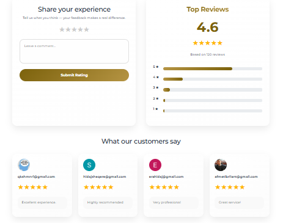

# H&O Company — Construction Business Platform


**Production-ready web platform designed to digitalize construction company operations, customer interactions, and internal workflows.**

This project reflects a real-world business application built with **scalability, maintainability, and performance in mind** — not a demo or tutorial project.

🌐 **Live Demo:** [hocompany1.com](https://hocompany1.com/)


---


## 📸 Application Preview

<table>
  <tr>
    <td>
      
    </td>
    <td>
      
    </td>
  </tr>
  <tr>
    <td>
      
    </td>
    <td>
      
    </td>
  </tr>
  <tr>
    <td colspan="2">
      
    </td>
  </tr>
</table>


## 🧩 Business Context

Construction companies typically manage job applications, scheduling, payments, and customer communication through disconnected tools or manual processes.

This fragmentation leads to:
- operational inefficiency  
- lack of visibility  
- poor user experience for both clients and administrators  

---

## 💡 Solution Overview

H&O Company centralizes these workflows into a single web platform that enables:
- structured job application management  
- role-based access and administration  
- scheduling and calendar coordination  
- secure online payments  
- transparent ratings and feedback  

The focus is on **real usability, clean UX, and long-term maintainability**, similar to production environments.

---

## ⚙️ Technical Architecture & Decisions

- **React** for a modular, component-driven frontend architecture  
- **RESTful PHP API** with **MySQL** for backend data handling  
- **Axios** for consistent and predictable API communication  
- **React Context & custom hooks** to separate business logic from UI  
- **Google OAuth** for frictionless authentication  
- **PayPal integration** for real-world payment flows  
- **React Big Calendar** for scheduling visualization  

**Key priorities during development:**
- predictable data flow  
- reusable and isolated components  
- proper loading and error handling  
- responsive behavior across devices  

---

## ✨ Core Functionality

- User registration and Google authentication  
- Job application submission and status tracking  
- Role-based UI behavior (admin vs user views)  
- Ratings and feedback system  
- Calendar-based scheduling  
- Secure payment handling  

---

## 📁 Project Structure

```text
api/        → PHP REST API (authentication, business logic, database access)
public/     → Static assets and application metadata
src/
 ├─ components/        → Reusable UI components
 ├─ pages/             → Application pages (Home, Jobs, Contact, About)
 ├─ features/          → Core feature modules (Applications, Calendar)
 ├─ hooks/             → Custom React hooks
 ├─ context/           → Global state management
 ├─ styles/            → CSS modules for components and pages
 ├─ App.js             → Main React app entry
 ├─ index.js           → ReactDOM render
 └─ firebase.js        → Firebase configuration & initialization
screenshots/           → Project screenshots for documentation

```

## 💻 Installation & Setup 

### 1️⃣ Clone Repository
```
git clone https://github.com/era123-1/h-o-company.git
cd h-o-company


```
2️⃣ Install Dependencies
```
npm install
```
3️⃣ Setup Environment Variables
```
Create a .env file at the project root:

- REACT_APP_FIREBASE_API_KEY=your_api_key
- REACT_APP_FIREBASE_AUTH_DOMAIN=your_auth_domain
- REACT_APP_FIREBASE_PROJECT_ID=your_project_id
- REACT_APP_PAYPAL_CLIENT_ID=your_paypal_client_id
```

4️⃣ Run Locally
```
npm start
```
